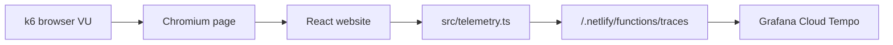

# k6 Testing For Frontend OpenTelemetry

This repo includes two k6 scripts:

| Script | Command | What it tests |
| --- | --- | --- |
| `k6/http-smoke.js` | `npm run k6:http` | Protocol-level HTTP checks. This does not run the React app JavaScript. |
| `k6/browser-otel.js` | `npm run k6:browser` | Browser-level checks. This opens Chromium, runs the React app, and exercises the frontend OTel path. |

Use the browser script when you want to validate telemetry in Grafana. Plain HTTP k6 traffic will hit the site, but it will not execute `src/telemetry.ts`.

## Install k6

On macOS:

```bash
brew install k6
```

The browser script also needs a Chromium-based browser installed locally, such as Google Chrome.

## Run Against Local Vite

Start the website:

```bash
npm run dev
```

In another terminal, run the HTTP smoke test:

```bash
npm run k6:http
```

For a very quick local check:

```bash
VUS=1 DURATION=5s npm run k6:http
```

Run the browser telemetry test:

```bash
npm run k6:browser
```

The default target is:

```bash
http://localhost:5173
```

## Run Against The Deployed Site

Pass `BASE_URL` when running either script:

```bash
BASE_URL=https://your-site.netlify.app npm run k6:http
BASE_URL=https://your-site.netlify.app npm run k6:browser
```

For the browser script, you can tune the amount of synthetic traffic:

```bash
BASE_URL=https://your-site.netlify.app VUS=5 DURATION=2m npm run k6:browser
```

Start gently. Browser tests are heavier than HTTP tests, and each visit can create multiple spans:

- document-load spans
- fetch spans
- `app.startup`
- `page_view`
- `load_projects`
- `user_click`
- `web-vital.*`

## Expected OTel Flow



## What The Browser Script Does

The browser script:

1. Opens the site.
2. Waits for network activity to settle.
3. Clicks the `Projects` nav link.
4. Fills the project search input.
5. Checks that the projects section rendered.
6. Clicks `Talks`, `About`, and `Contact`.
7. Waits briefly so click and Web Vital spans have time to export.

That should exercise the important spans from the current implementation:

| Span | Why it should appear |
| --- | --- |
| `app.startup` | Created during `initTelemetry()`. |
| `page_view` | Created during `initTelemetry()`. |
| document-load spans | Created by `DocumentLoadInstrumentation`. |
| fetch spans | Created by `FetchInstrumentation` when projects are loaded from GitHub. |
| `load_projects` | Created manually in `Projects.tsx`. |
| `user_click` | Created by the document click listener. |
| `web-vital.*` | Created from `web-vitals` callbacks. |

## Useful Grafana TraceQL Checks

After running `npm run k6:browser`, wait a minute or two, then check Tempo:

```traceql
{resource.service.name="personal-website"}
```

Project loading:

```traceql
{resource.service.name="personal-website" && name="load_projects"}
```

Synthetic click traffic:

```traceql
{resource.service.name="personal-website" && name="user_click"}
```

Web Vitals:

```traceql
{resource.service.name="personal-website" && name=~"web-vital.*"}
```

GitHub fetch instrumentation:

```traceql
{resource.service.name="personal-website" && span.app.request.kind="github_api"}
```

## Notes

- Local Vite runs without the Netlify Function unless you use Netlify Dev. For full trace forwarding locally, use a deployed site or run the app through Netlify Dev with `GRAFANA_OTLP_ENDPOINT` and `GRAFANA_OTLP_AUTH` configured.
- The deployed site is the best target when validating the complete OTel export path.
- Keep synthetic load small at first so you do not create noisy or expensive telemetry volume.
