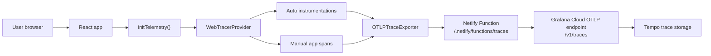
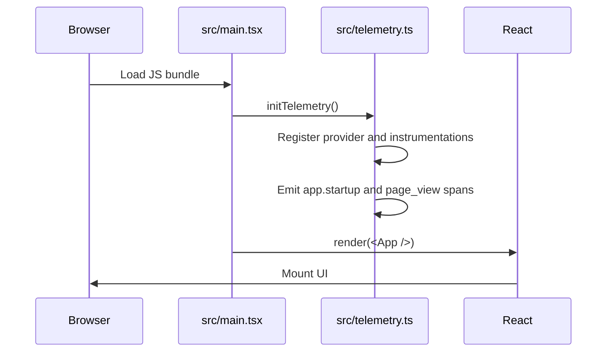
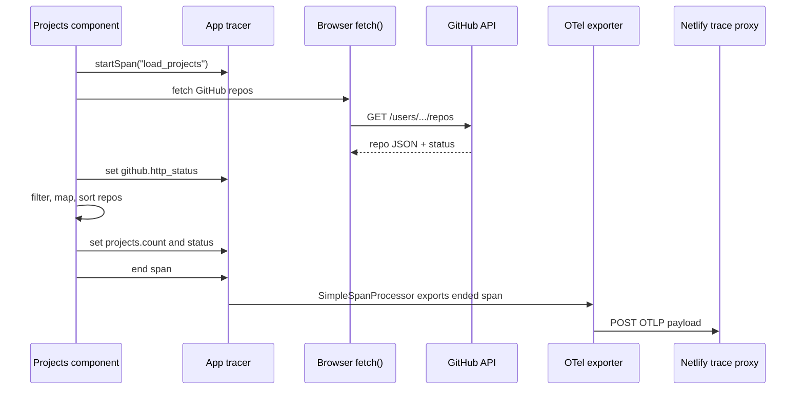
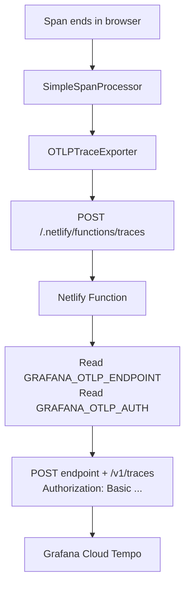
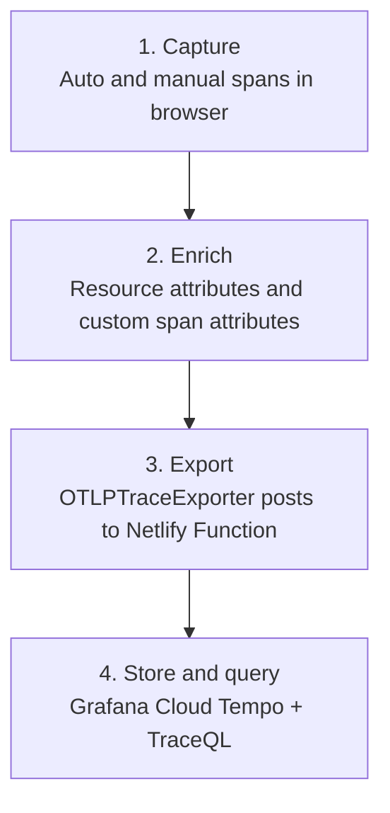

# OpenTelemetry Architecture Review

This repository is a Vite + React personal website with browser-side OpenTelemetry tracing and a Netlify Function that forwards traces to Grafana Cloud Tempo.

The current implementation sends **traces only**. It does not configure OTel logs or OTel metrics. Web Vitals are represented as short spans so they can be queried in Tempo alongside page-load, click, and GitHub project-loading traces.

## Executive Summary

OpenTelemetry is initialized before React renders in `src/main.tsx`, so page-load instrumentation can observe the initial browser lifecycle. The browser creates spans through a mix of auto-instrumentation and manual spans, exports them with the OTLP HTTP trace exporter, and posts them to a local Netlify Function at `/.netlify/functions/traces`.

The Netlify Function then appends `/v1/traces`, attaches Grafana Cloud Basic auth from server-side environment variables, and forwards the OTLP payload to Grafana Cloud.

This proxy shape is the strongest part of the setup: Grafana credentials are no longer embedded in the client bundle.

## High-Level Flow



## Where OTel Lives

| Area | File | Purpose |
| --- | --- | --- |
| App bootstrap | `src/main.tsx` | Calls `initTelemetry()` before React renders. |
| Browser OTel setup | `src/telemetry.ts` | Creates provider, exporter, resources, auto-instrumentations, manual startup/page/click/Web Vital spans. |
| Feature span | `src/components/sections/projects/Projects.tsx` | Creates a `load_projects` span around the GitHub repository fetch and mapping work. |
| Trace proxy | `netlify/functions/traces.ts` | Receives browser OTLP payloads and forwards them to Grafana Cloud with server-side auth. |
| Dependencies | `package.json` | Declares OTel SDK, exporter, instrumentations, semantic conventions, and Web Vitals packages. |

## Bootstrap Order

The app initializes telemetry before rendering the React tree:

```tsx
// src/main.tsx
import { initTelemetry } from "./telemetry";

// Initialise OpenTelemetry before rendering so page-load spans are captured.
initTelemetry();

createRoot(document.getElementById("root")!).render(
  <StrictMode>
    <App />
  </StrictMode>,
);
```

That order matters because `DocumentLoadInstrumentation` needs to be registered as early as possible. If React rendered first and telemetry started later, some page-load timings could be missed.



## Provider, Resource, Exporter, Processor

`src/telemetry.ts` builds the core OTel objects:

```ts
// src/telemetry.ts
const resource = resourceFromAttributes({
  [ATTR_SERVICE_NAME]: SERVICE_NAME,
  [ATTR_SERVICE_VERSION]: import.meta.env.VITE_APP_VERSION ?? "0.0.0",
  "deployment.environment": import.meta.env.MODE,
});

const exporter = new OTLPTraceExporter({
  url: "/.netlify/functions/traces",
});

const provider = new WebTracerProvider({
  resource,
  spanProcessors: [new SimpleSpanProcessor(exporter)],
});
```

What each piece does:

| Piece | Role |
| --- | --- |
| `resourceFromAttributes(...)` | Adds shared metadata to every span, including service name, app version, and deployment environment. |
| `WebTracerProvider` | Browser trace provider that owns tracers and span processing. |
| `SimpleSpanProcessor` | Exports spans as soon as they end. This is reasonable for a small browser app because it reduces the chance of losing spans when a user closes the tab. |
| `OTLPTraceExporter` | Serializes spans into OTLP and posts them to the Netlify proxy. |

Current shared resource attributes:

| Attribute | Value source |
| --- | --- |
| `service.name` | `personal-website` |
| `service.version` | `import.meta.env.VITE_APP_VERSION ?? "0.0.0"` |
| `deployment.environment` | `import.meta.env.MODE` |

## Auto-Instrumentation

The repo registers three browser auto-instrumentations:

```ts
// src/telemetry.ts
registerInstrumentations({
  instrumentations: [
    new DocumentLoadInstrumentation(),
    new FetchInstrumentation({
      propagateTraceHeaderCorsUrls: [/localhost/],
      clearTimingResources: true,
      applyCustomAttributesOnSpan: (span, request, response) => {
        // custom request/response attributes
      },
    }),
    new XMLHttpRequestInstrumentation({
      propagateTraceHeaderCorsUrls: [/localhost/],
    }),
  ],
});
```

### Document Load

`DocumentLoadInstrumentation` captures page-load timing spans. These help answer questions such as:

| Question | Example signal |
| --- | --- |
| Did the page load slowly? | document-load span duration |
| Which resources were involved? | resource timing child spans |
| Which environment had the issue? | `deployment.environment` resource attribute |

### Fetch

`FetchInstrumentation` traces browser `fetch()` calls. In this app, the most important fetch is the GitHub repositories request in `Projects.tsx`.

The setup intentionally restricts trace-header propagation:

```ts
propagateTraceHeaderCorsUrls: [/localhost/],
```

The inline comment explains why:

```ts
// Do not propagate trace headers to GitHub from the browser.
// GitHub API calls can fail CORS preflight if extra tracing headers are sent.
```

That means OTel may create a span for the GitHub fetch, but it will not send `traceparent` headers to GitHub in production. This avoids browser CORS preflight failures.

The instrumentation also enriches fetch spans:

```ts
// src/telemetry.ts
span.setAttribute("app.request.url", url);

if (url.includes("api.github.com")) {
  span.setAttribute("app.request.kind", "github_api");
}

if (response && response instanceof Response) {
  span.setAttribute("app.response.ok", response.ok);
  span.setAttribute("app.response.status", response.status);
}
```

### XMLHttpRequest

`XMLHttpRequestInstrumentation` is registered for coverage in case any dependency or future code uses XHR instead of `fetch()`. The current repository primarily uses `fetch()`.

## Manual Spans

Manual spans are useful when the app wants to capture product-level events that auto-instrumentation cannot infer.

### Startup Span

`app.startup` records visit-level browser context:

```ts
// src/telemetry.ts
const startupSpan = tracer.startSpan("app.startup", {
  attributes: {
    "page.url": window.location.href,
    "page.path": window.location.pathname,
    "page.referrer": document.referrer || "direct",
    "browser.language": navigator.language,
    "screen.width": window.screen.width,
    "screen.height": window.screen.height,
  },
});
startupSpan.end();
```

This span is intentionally short. Its value is in the attributes: URL, path, referrer, language, and screen size.

### Page View Span

`page_view` guarantees one trace per visit even when no network request or interaction occurs:

```ts
// src/telemetry.ts
const pageViewSpan = tracer.startSpan("page_view", {
  attributes: {
    "page.url": window.location.href,
    "page.path": window.location.pathname,
    "page.title": document.title,
  },
});
pageViewSpan.end();
```

### Click Span

The app manually tracks clicks instead of relying on `@opentelemetry/instrumentation-user-interaction`:

```ts
// src/telemetry.ts
document.addEventListener(
  "click",
  (event) => {
    const target = event.target as HTMLElement | null;
    if (!target) return;

    const interactiveEl =
      target.closest("a, button, [role='button'], input, select, textarea") ??
      target;

    const span = tracer.startSpan("user_click", {
      attributes: {
        "click.tag": interactiveEl.tagName.toLowerCase(),
        "click.text": (interactiveEl.textContent ?? "").trim().slice(0, 120),
        "click.aria_label": interactiveEl.getAttribute("aria-label") ?? "",
        "click.href":
          interactiveEl instanceof HTMLAnchorElement ? interactiveEl.href : "",
        "click.page_path": window.location.pathname,
      },
    });

    span.end();
  },
  { capture: true },
);
```

This produces a `user_click` span for every click, including clicks that do not trigger a fetch, XHR, or route change.

### Web Vitals Spans

The app lazy-loads `web-vitals` and sends each metric as a span:

```ts
// src/telemetry.ts
async function reportWebVitals() {
  const { onCLS, onFCP, onLCP, onTTFB, onINP } = await import("web-vitals");
  const tracer = getAppTracer();

  function sendVitalAsSpan(metric: Metric) {
    const span = tracer.startSpan(`web-vital.${metric.name}`, {
      attributes: {
        "web_vital.name": metric.name,
        "web_vital.id": metric.id,
        "web_vital.value": metric.value,
        "web_vital.rating": metric.rating,
        "web_vital.navigation_type": metric.navigationType,
      },
    });

    span.setStatus({ code: SpanStatusCode.OK });
    span.end();
  }

  onCLS(sendVitalAsSpan);
  onFCP(sendVitalAsSpan);
  onLCP(sendVitalAsSpan);
  onTTFB(sendVitalAsSpan);
  onINP(sendVitalAsSpan);
}
```

These spans make Core Web Vitals searchable in Tempo. They are not OTel metric points, so dashboards should query them as traces or use TraceQL metrics if enabled in Grafana Cloud.

## Feature-Level Trace: Loading Projects

`Projects.tsx` creates an application span around the GitHub repositories workflow:

```tsx
// src/components/sections/projects/Projects.tsx
const span = tracer.startSpan("load_projects", {
  attributes: {
    "projects.source": "github",
    "projects.user": "roxanaanamariaturc",
  },
});

try {
  const response = await fetch(
    "https://api.github.com/users/roxanaanamariaturc/repos",
  );

  span.setAttribute("github.http_status", response.status);

  if (!response.ok) {
    span.setStatus({
      code: SpanStatusCode.ERROR,
      message: `GitHub request failed with status ${response.status}`,
    });
    throw new Error(`GitHub request failed: ${response.status}`);
  }

  const data = await response.json();
  span.setAttribute("github.repo_count_raw", data.length);

  // map/filter/sort projects
  span.setAttribute("projects.count", mapped.length);
  span.setStatus({ code: SpanStatusCode.OK });
} catch (error) {
  span.recordException(error as Error);
  span.setStatus({
    code: SpanStatusCode.ERROR,
    message: error instanceof Error ? error.message : "Unknown error",
  });
} finally {
  span.end();
}
```

This is the most business-specific span in the app. It tracks:

| Attribute | Meaning |
| --- | --- |
| `projects.source` | Data source, currently `github`. |
| `projects.user` | GitHub user whose repos are requested. |
| `github.http_status` | HTTP status from the GitHub API. |
| `github.repo_count_raw` | Raw number of repos returned by GitHub. |
| `projects.count` | Number of projects shown after filtering/mapping. |



## Export Path And Netlify Proxy

The browser exporter posts to a same-origin function:

```ts
// src/telemetry.ts
const exporter = new OTLPTraceExporter({
  url: "/.netlify/functions/traces",
});
```

The Netlify Function forwards the body to Grafana Cloud:

```ts
// netlify/functions/traces.ts
const endpoint = process.env.GRAFANA_OTLP_ENDPOINT;
const auth = process.env.GRAFANA_OTLP_AUTH;

const response = await fetch(`${endpoint}/v1/traces`, {
  method: "POST",
  headers: {
    "Content-Type": incomingContentType,
    Authorization: `Basic ${auth}`,
  },
  body,
});
```



This keeps `GRAFANA_OTLP_AUTH` out of the JavaScript bundle. Only the Netlify runtime should know the Grafana credentials.

## Flush Behavior

Browser tabs are short-lived, so the code flushes when the page becomes hidden:

```ts
// src/telemetry.ts
document.addEventListener("visibilitychange", () => {
  if (document.visibilityState === "hidden") {
    provider.forceFlush().catch(() => {
      // best effort only
    });
  }
});
```

Together with `SimpleSpanProcessor`, this reduces lost spans for late events such as CLS and INP.

## Span Inventory

| Span name | Created by | Type | Notes |
| --- | --- | --- | --- |
| Document-load spans | `DocumentLoadInstrumentation` | automatic | Browser load lifecycle and resource timings. |
| Fetch spans | `FetchInstrumentation` | automatic | Includes custom `app.request.*` and `app.response.*` attributes. |
| XHR spans | `XMLHttpRequestInstrumentation` | automatic | Future-proofing for XHR usage. |
| `app.startup` | `src/telemetry.ts` | manual | Browser/session context. |
| `page_view` | `src/telemetry.ts` | manual | Guaranteed visit span. |
| `user_click` | `src/telemetry.ts` | manual | Captures every click at document capture phase. |
| `web-vital.CLS` | `web-vitals` callback | manual | Core Web Vital represented as span. |
| `web-vital.FCP` | `web-vitals` callback | manual | Core Web Vital represented as span. |
| `web-vital.LCP` | `web-vitals` callback | manual | Core Web Vital represented as span. |
| `web-vital.TTFB` | `web-vitals` callback | manual | Core Web Vital represented as span. |
| `web-vital.INP` | `web-vitals` callback | manual | Core Web Vital represented as span. |
| `load_projects` | `Projects.tsx` | manual | GitHub project loading workflow. |

## Configuration

For local/deployed configuration, use:

```bash
GRAFANA_OTLP_ENDPOINT=https://otlp-gateway-prod-eu-west-2.grafana.net/otlp
GRAFANA_OTLP_AUTH=<base64 instanceId:token>
VITE_APP_VERSION=0.0.0
```

Important details:

| Variable | Runtime | Purpose |
| --- | --- | --- |
| `GRAFANA_OTLP_ENDPOINT` | Netlify Function | Base OTLP endpoint. Do not include `/v1/traces`; the function appends it. |
| `GRAFANA_OTLP_AUTH` | Netlify Function | Base64 encoded Grafana Cloud credentials used in the Basic auth header. |
| `VITE_APP_VERSION` | Browser bundle | Public app version attached to spans as `service.version`. |

## Review Notes

### Good Decisions

| Decision | Why it works well |
| --- | --- |
| Same-origin trace proxy | Avoids exposing Grafana Cloud auth in browser JavaScript. |
| Early telemetry initialization | Gives document-load instrumentation the best chance to capture initial page timing. |
| Restricted trace-header propagation | Avoids breaking GitHub API requests with CORS preflight issues. |
| Manual `page_view` span | Guarantees one span per visit even when auto-instrumentation has nothing to capture. |
| Manual click spans | Captures UI interactions even when they do not trigger async work. |
| Web Vitals as spans | Makes frontend performance data queryable in Tempo. |

### Risks And Improvements

| Priority | Area | Observation | Suggested change |
| --- | --- | --- | --- |
| High | Docs/config drift | The older setup guide and previous `.env.example` shape referenced browser-exposed `VITE_OTEL_*` credentials, but the implementation now uses server-side `GRAFANA_*` variables. | Keep docs centered on the Netlify proxy model and avoid reintroducing `VITE_OTEL_EXPORTER_OTLP_AUTH`. |
| Medium | Duplicate project loading in dev | React `StrictMode` can run effects twice in development, so `load_projects` may appear twice locally. | This is acceptable for dev; if noisy, guard the effect with a `useRef` in development. |
| Medium | Privacy | `user_click` records visible text, classes, IDs, and hrefs. This is fine for a personal static site, but it can become sensitive if forms or private content are added. | Keep truncation and avoid capturing input values. Consider removing `click.class` if CSS module class names are not useful in Grafana. |
| Medium | Cardinality | `app.request.url`, `click.href`, and `click.text` can create many unique attribute values. | Keep values bounded, and avoid adding user-specific IDs or free-form input text. |
| Low | Function response body | The trace proxy returns the upstream body to the browser. This is useful for debugging, but unnecessary in production. | Consider returning only `{ "status": "ok" }` for successful exports. |
| Low | Metrics terminology | Web Vitals are spans, not true OTel metrics. | Name dashboards and docs carefully so future readers know they are using trace data or TraceQL metrics. |

## Useful TraceQL Starting Points

Find all traces for the service:

```traceql
{resource.service.name="personal-website"}
```

Find project-loading spans:

```traceql
{resource.service.name="personal-website" && name="load_projects"}
```

Find GitHub fetch spans:

```traceql
{resource.service.name="personal-website" && span.app.request.kind="github_api"}
```

Find Web Vitals that were rated poor:

```traceql
{resource.service.name="personal-website" && name=~"web-vital.*" && span.web_vital.rating="poor"}
```

Find click events:

```traceql
{resource.service.name="personal-website" && name="user_click"}
```

## Mental Model

Think of the setup in four layers:



The browser knows how to create spans. The Netlify Function knows the secret needed to ship those spans to Grafana. Grafana stores the traces and gives you TraceQL for investigation and dashboards.

